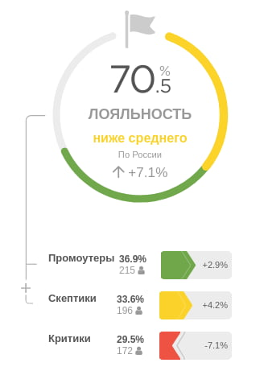

# Тестовое задание: HTML-верстальщик

### Задача:

Сверстать нижеприведенный макет из растрового изображения в HTML. Можно использовать 
любые подходы, главное, чтобы выполнялись следующие условия:
1. Свёрстанная страница должна без ошибок открываться в IE11, и для этого не нужно прогонять 
   её через дополнительные преобразователи (Babel, Autoprefixer и т.д.);
2. желательно НЕ использовать JS;
3. нельзя использовать сторонние библиотеки компонентов. 

Иконка флага находится в папке `assets`

#### Дополнительные задачи по желанию: 

1. Представьте, что дальше свёрстанный макет перейдёт фронтендеру. Как можно разбить его на 
компоненты? Пометьте комментариями. 
2. Сделайте желтую и зелёную полосы анимированными, чтобы при изменении их длины они плавно
"растягивались". Также должно работать кроссбраузерно. 
   
#### Задача "со звёздочкой":
Настройте любую систему сборки для проекта (Webpack, Rollup, или другие).

### Результат 

В качестве выполненного задания просьба прислать на обговоренный контакт ссылку на 
GIT-репозиторий. В Readme укажите, какие файлы являются результатом. Страница должна 
открываться в браузере без дополнительных сборок (то есть, в репозитории должен быть 
конечный результат).